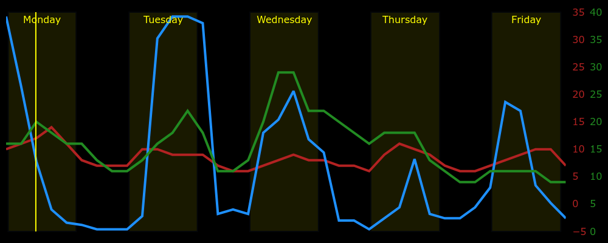

# Python Met Office Meteogram
A python script to fetch weather forecast data from the UK Met Office Datapoint API, and display it as a Meteogram.

This is a work in progress. Currently, the generated Meteogram looks like this:

You can read about the background to this project in [this blog post](https://ianrenton.com/blog/making-meteograms-in-python/).

## Features

* The red line shows temperature in Celsius between defined limits. Low temperatures in the forecast will cause frost and ice indicators to appear on the chart.
* The green line shows wind speed in miles per hour, between zero and a defined limit.
* The blue line shows precipitation probability from 0 to 100%.
* The vertical yellow bands show hours of daylight, named for their day of the week, and the solid yellow vertical line shows the current time when the meteogram was generated.
* Weather symbols across the bottom of the meteogram are based on the forecasted conditions.

## Future Plans

* Frost warnings
* Storm warnings
* Outdoor laundry drying indicator

## Running your own copy

If you would like to use this script for yourself, follow these steps:

1. Ensure you have python version >= 3.8 installed
2. Clone the repository from Github
3. Install the required dependencies by running `pip install -r requirements.txt`
4. Copy or rename the `.env.example` file to `.env`
5. Edit `.env` in your preferred editor. You will need:
    * A Met Office Datapoint API key. These are free, but you need to create an account. [Instructions can be found here](https://www.metoffice.gov.uk/services/data/datapoint/api).
    * Your location code. There is unfortunately no nice public list of these, so you will have to use your API key to look it up. [The documentation for this is here](https://www.metoffice.gov.uk/services/data/datapoint/uk-locations-site-list-detailed-documentation). I found the easiest way was to fetch the complete list of locations by calling `http://datapoint.metoffice.gov.uk/public/data/val/wxfcs/all/json/sitelist?key=YOUR_API_KEY` and searching through the results for my town.
6. Make any other adjustments to parameters in `.env` based on the climate of your location, then save it.
7. Run `python meteogram.py`
8. View the meteogram, which will be saved as `output.png`.

## Thanks / Licence Information

My own original code created for this project is licenced under "The Unlicence" as described in the `LICENCE` file.

The repository also contains weather icons inside the `icons` folder which are from the [Adwaita](https://github.com/GNOME/adwaita-icon-theme) icon set and subject to its licence terms (LGPL/CC BY-SA 3), used with many thanks.