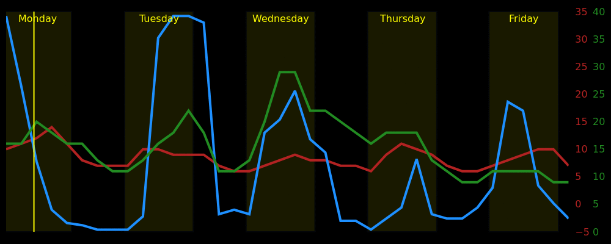

# Home Meteogram Display
A python script to display a Meteogram, along with other information. It is designed as a passive weather display for an ultra-widescreen monitor, but the generated image is also suitable for inclusion in web-based dashboards and other types of informational display. Weather forecast data is currently taken from the UK Met Office DataHub API.

You can read about the background to this project in [this blog post](https://ianrenton.com/blog/making-meteograms-in-python/), and if you're interested in the hardware as well, [the full build guide is here](https://ianrenton.com/projects/meteogram/).

## Features

* The red line shows temperature in Celsius between defined limits. Low temperatures in the forecast will cause frost and ice indicators to appear on the chart. You can use the "feels like" or real temperatures.
* The green line shows wind speed in miles per hour, between zero and a defined limit.
* The blue line shows precipitation probability from 0 to 100%.
* The purple line shows humidity from 0 to 100%.
* The vertical yellow bands show hours of daylight, named for their day of the week, and the solid yellow vertical line shows the current time when the meteogram was generated.
* Weather symbols across the bottom of the meteogram are based on the forecasted conditions.
* Bars across the bottom of the display warn of frosts and storms, and will also display good days for drying laundry outside.
* Additional bars aross the bottom of the display can be used to display calendar events.
* All of these features can be toggled on and off, colours changed, etc. in a config file.

## Running your own copy

If you would like to use this script for yourself, follow these steps:

1. Ensure you have python version >= 3.8 installed
2. Clone the repository from Github
3. Install the required dependencies by running `pip install -r requirements.txt`
4. Copy or rename the `config.yml.example` file to `config.yml`
5. Edit `config.yml` in your preferred editor. You will need:
    * A Met Office DataHub API client key and secret. To get these, you will need to create an account on the [Met Office DataHub site](https://metoffice.apiconnect.ibmcloud.com/metoffice/production/) and subscribe to the Site Specific forecast service. This is free for 360 API calls per day.
    * Your approximate position, in latitude and longitude. You can look this up using Google Maps or other online services.
6. Make any other adjustments to parameters in `.env` based on the climate of your location and your personal preferences, then save it.
7. Run `python meteogram.py`
8. View the meteogram, which will be saved as `output.png`.

## Thanks / Licence Information

My own original code created for this project is licenced under "The Unlicence" as described in the `LICENCE` file.

The repository also contains weather icons inside the `icons` folder which are from the [Adwaita](https://github.com/GNOME/adwaita-icon-theme) icon set and subject to its licence terms (LGPL/CC BY-SA 3), used with many thanks.