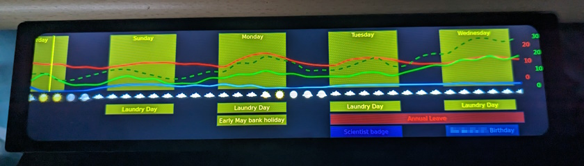
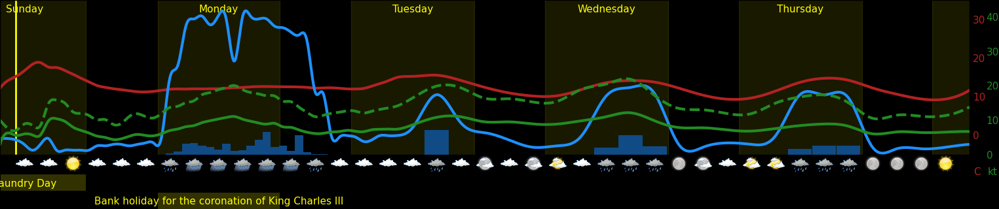

# Home Meteogram Display
A python script to display a Meteogram, along with other information. It is designed as a passive weather display for an ultra-widescreen monitor, but the generated image is also suitable for inclusion in web-based dashboards and other types of informational display. Weather forecast data is currently taken from the UK Met Office DataHub API.

You can read about the background to this project in [this blog post](https://ianrenton.com/blog/making-meteograms-in-python/), and if you're interested in the hardware as well, [the full build guide is here](https://ianrenton.com/projects/meteogram/).

## Features

* The red line shows temperature in Celsius between defined limits. Low temperatures in the forecast will cause frost and ice indicators to appear on the chart. You can use the "feels like" or real temperatures.
* The green line shows wind speed in miles per hour, between zero and a defined limit.
* The blue line shows precipitation probability from 0 to 100%.
* The purple line shows humidity from 0 to 100%.
* The vertical yellow bands show hours of daylight, named for their day of the week, and the solid yellow vertical line shows the current time when the meteogram was generated.
* Weather symbols across the bottom of the meteogram are based on the forecasted conditions.
* Bars across the bottom of the display warn of frosts and storms, and will also display good days for drying laundry outside.
* Additional bars aross the bottom of the display can be used to display calendar events.
* All of these features can be toggled on and off, colours changed, etc. in a config file.

## Running your own copy

If you would like to use this script for yourself, follow these steps:

1. Ensure you have python version >= 3.8 installed
2. Clone the repository from Github
3. Install the required dependencies by running `pip install -r requirements.txt`

*(Running on an old Raspberry Pi and seeing an error about missing compilers when installing `scipy`, or waiting a very long time for it to install `numpy`? It's easiest to install these using the package manager, e.g. `sudo apt install python3-scipy python3-numpy`, rather than letting `pip` try to build them from source. Once complete, re-run the command above.)*

4. Copy or rename the `config.yml.example` file to `config.yml`
5. Edit `config.yml` in your preferred editor. You will need:
    * A Met Office DataHub API client key and secret. To get these, you will need to create an account on the [Met Office DataHub site](https://metoffice.apiconnect.ibmcloud.com/metoffice/production/) and subscribe to the Site Specific forecast service. This is free for 360 API calls per day.
    * Your approximate position, in latitude and longitude. You can look this up using Google Maps or other online services.
6. Make any other adjustments to parameters in `config.yml` based on the climate of your location and your personal preferences, then save it.
7. Run `python meteogram.py`
8. View the meteogram, which will be saved as `output.png`.

## Setting the Desktop Wallpaper

The included `setwp.sh` script can be used to regenerate the meteogram image, and set it as the desktop wallpaper using `pcmanfm`, the Raspberry Pi OS default desktop renderer. You can run this manually (after making it executable with `chmod +x setwp.sh`), or add it as a cron job.

## Plotly vs Matplotlib

Up to version 1.0 of this code, the Plotly library was used to draw the chart and all the features on it. Unfortunately Plotly has a limitation when it comes to my use case of running on an original Raspberry Pi Model B, which is that its Kaleido dependency does not have builds for its `armv6l` architecture. I therefore rewrote the script using Matplotlib, which is easier to get working on the old device.

## Thanks / Licence Information

My own original code created for this project is licenced under "The Unlicence" as described in the `LICENCE` file.

The repository also contains weather icons inside the `icons` folder which are from the [Adwaita](https://github.com/GNOME/adwaita-icon-theme) icon set and subject to its licence terms (LGPL/CC BY-SA 3), used with many thanks.